<div align="center">

# ⚡ XENO INFERENCE
### *Omni-Modal Autonomous Inference Engine, Multi-Agent Swarm Harness & Sovereign Terminal Workstation*

[](https://www.rust-lang.org/)
[](https://opensource.org/licenses/MIT)
[](https://github.com/Aman-Gautam67/Xeno-Inference)
[](https://github.com/Aman-Gautam67/Xeno-Inference)
[](https://github.com/Aman-Gautam67/Xeno-Inference)

```text
┌────────────────────────────────────────────────────────────────────────────────────────┐
│    _  ________   ______     _____   ____________________  ______   ____________        │
│   | |/ / ____/ | / / __ \   /  _/ | / / ____/ ____/ __ \/ ____/ | / / ____/ ____/      │
│   |   / __/ /  |/ / / / /   / //  |/ / /_  / __/ / /_/ / __/ /  |/ / /   / __/         │
│  /   / /___/ /|  / /_/ /  _/ // /|  / __/ / /___/ _, _/ /___/ /|  / /___/ /___         │
│ /_/|_\____/_/ |_/\____/  /___/_/ |_/_/   /_____/_/ |_/_____/_/ |_/\____/_____/         │
│                                                                                        │
│          [ HYBRID LOCAL/CLOUD COMPUTE ] ❖ [ MULTI-AGENT SWARM HARNESS ]               │
└────────────────────────────────────────────────────────────────────────────────────────┘
```

**[Explore Blueprint](XENO_INFERENCE_BLUEPRINT.md)** • **[Architecture](#system-architecture)** • **[Quickstart](#quickstart)** • **[CLI / TUI](#xeno-cli--tui)** • **[Authors](#authors--maintainers)**

---

</div>

## 📖 Table of Contents
1. [Overview & Product Vision](#-overview--product-vision)
2. [Key Capabilities](#-key-capabilities)
3. [System Architecture](#-system-architecture)
4. [Crates & Subsystems Breakdown](#-crates--subsystems-breakdown)
5. [Quickstart & Installation](#-quickstart--installation)
6. [XENO CLI / TUI Guide](#-xeno-cli--tui-guide)
7. [Desktop Spatial Canvas](#-desktop-spatial-canvas)
8. [Security & Sandboxing](#-security--sandboxing)
9. [Test Suite & Verification](#-test-suite--verification)
10. [Project Structure](#-project-structure)
11. [Authors & Maintainers](#-authors--maintainers)
12. [License](#-license)

---

## 🌟 Overview & Product Vision

**XENO INFERENCE** is an ultra-futuristic, sovereign artificial intelligence inference workstation and multi-agent development environment designed to bridge local hardware acceleration and hyperscale cloud intelligence.

Contemporary AI tools isolate users into rigid single-chat interfaces (ChatGPT, Claude web), basic local runners (Ollama, LM Studio), or text-only terminal CLIs. **XENO INFERENCE** unifies these paradigms into a single, cohesive, high-performance ecosystem:

- **Unified Dual-Inference**: Local GGUF/quantized models (NVIDIA CUDA, Apple Metal, CPU AVX) multiplexed with cloud providers (Anthropic Claude 3.7 Thinking, OpenAI o1/o3-mini/GPT-4o, Google Gemini 2.0, DeepSeek R1, Groq LPU).
- **Autonomous Agent Harness (PAORV)**: Plan-Act-Observe-Reflect-Verify continuous loop with recursive self-healing and dynamic AST invariant checks.
- **Hierarchical Swarm Council**: 5 autonomous specialized roles (Commander, Architect, Coder, QA Tester, Red-Team Auditor) with 3-way cross-model consensus.
- **Dual-Surface Interface**: High-speed Cyberpunk Terminal TUI (`ratatui` + `crossterm`) alongside a GPU-accelerated desktop spatial canvas (Tauri v2 + React 19).
- **Sandboxed Virtual PTY**: Windows ConPTY and POSIX PTY isolated with Windows Job Objects and namespace bounds.
- **Microsecond Observability**: Live execution DAG, token velocity meter (TTFT, tok/s), and structured cognitive step timeline (with strict zero private CoT leakage).

---

## ⚡ Key Capabilities

| Dimension | XENO INFERENCE | Traditional Tools / CLIs |
| :--- | :--- | :--- |
| **Compute Model** | **Hybrid Local + Cloud Unified** | Cloud-only or Local-only |
| **Agentic Loop** | **Recursive PAORV + Self-Healing** | Simple linear tool-retry loops |
| **Swarm Orchestration**| **5-Role Council + 3-Way Consensus** | Single agent or rigid linear pipelines |
| **Terminal Execution**| **Sandboxed Virtual PTY (ConPTY / Job Objects)**| Unrestricted shell access or basic subshell |
| **File Editing** | **Atomic Exact AST Multi-Replacement** | Whole-file rewrite or fragile regex diffs |
| **User Interfaces** | **Cyberpunk TUI + Spatial Node Canvas** | Text-only CLI or linear web chat |
| **Security & Privacy**| **Air-Gap Socket Enforcer + Secret Scrubber** | Direct unmonitored API calls |

---

## 🏗️ System Architecture

```mermaid
graph TB
    subgraph UI["PRESENTATION LAYER"]
        CLI["XENO CLI (Ratatui TUI)"]
        Canvas["Desktop Spatial Canvas (React 19 + Tauri v2)"]
    end

    subgraph Core["XENO CORE APPLICATION DAEMON (Rust)"]
        Router["Intelligent Semantic Router & Policy Engine"]
        TokenBus["Tokio Async Token Bus & Velocity Tracker"]
        Harness["PAORV Autonomous Agent Harness"]
        Swarm["5-Role Swarm Council (Commander/Architect/Coder/QA/RedTeam)"]
        DAG["Real-Time Execution DAG (Petgraph)"]
        PTY["Sandboxed Virtual PTY Manager (ConPTY / Job Objects)"]
        AST["Atomic AST File Engine & Syntax Validator"]
        Telemetry["Observable Telemetry Collector (Zero CoT Leak)"]
    end

    subgraph Providers["INFERENCE PROVIDER GATEWAY"]
        Local["Local Endpoint (llama.cpp / vLLM / Ollama)"]
        Claude["Anthropic Claude 3.7 (Thinking Blocks)"]
        OpenAI["OpenAI o1 / o3-mini / GPT-4o"]
        Gemini["Google Gemini 2.0 Pro / Flash"]
        DeepSeek["DeepSeek R1 / V3"]
        Groq["Groq LPU (Ultra-Low Latency)"]
        Mock["Deterministic Mock Engine"]
    end

    CLI <--> Core
    Canvas <--> Core
    Router --> Local
    Router --> Claude
    Router --> OpenAI
    Router --> Gemini
    Router --> DeepSeek
    Router --> Groq
    Router --> Mock
    TokenBus --> Telemetry
    Harness <--> DAG
    Harness <--> Swarm
    Harness <--> PTY
    Harness <--> AST
```



---

## 📦 Crates & Subsystems Breakdown

The codebase is organized as a modular, high-performance Cargo workspace:

- **[`crates/xeno-core`](crates/xeno-core)**: Core data contracts (`XenoAgentStepEvent`, `XenoDAGNode`, `TokenMetrics`), Serde serialization schemas, and unified error taxonomy (`XenoError`).
- **[`crates/xeno-router`](crates/xeno-router)**: Multi-provider inference gateway, policy router (`SpeedPriority`, `ReasoningPriority`, `PrivacyGuard`, `CostOptimized`), SSE parser, token velocity tracker, and socket air-gap enforcer.
- **[`crates/xeno-tools`](crates/xeno-tools)**: Sandboxed virtual PTY manager (`portable-pty` + Windows Job Objects), AST syntax validator (Rust, Python, JSON, TOML, JS/TS), atomic file patcher (`multi_replace_file_content`), fuzzy ripgrep, and strict Python runtime binding (`python.exe`).
- **[`crates/xeno-dag`](crates/xeno-dag)**: Petgraph execution graph manager, topological cycle detection, dynamic subgraph grafting, and streaming status broadcast.
- **[`crates/xeno-telemetry`](crates/xeno-telemetry)**: High-speed ring-buffer telemetry collector, velocity calculation, and privacy guard preventing unauthorized internal chain-of-thought exposure.
- **[`crates/xeno-agent`](crates/xeno-agent)**: Continuous PAORV state machine, multi-agent swarm council, 3-way cross-model consensus engine, L1/L2 memory, and native Model Context Protocol (MCP) host.
- **[`crates/xeno-cli`](crates/xeno-cli)**: Cyberpunk terminal TUI (`ratatui` + `crossterm`) with Unicode DAG graphs, HUD meters, active diff view, and command bar.
- **[`crates/xeno-tauri`](crates/xeno-tauri)** & **[`ui-canvas`](ui-canvas)**: Tauri v2 IPC bridge and React 19 + Vite desktop spatial canvas.
- **[`tests/`](tests)**: Comprehensive 5-tier integration and E2E test suite.

---

## 🚀 Quickstart & Installation

### Prerequisites
- **Rust**: `1.97.0+` (`cargo`, `rustc`)
- **Node.js**: `v20+` / `npm` (for Desktop Spatial Canvas)
- **Python**: `python.exe` (Python 3.10+)
- **OS**: Windows 11 / 10, macOS Sonoma / Sequoia, or Linux x86_64 / aarch64

### 1. Clone the Repository
```bash
git clone https://github.com/Aman-Gautam67/Xeno-Inference.git
cd Xeno-Inference
```

### 2. Build the Workspace
```bash
cargo build --release
```

### 3. Run the Test Suite
```bash
cargo test --workspace
```

---

## 💻 XENO CLI / TUI Guide

Launch the high-performance terminal edition:

```bash
cargo run --bin xeno-cli
```

```text
  ██╗  ██╗ ███████╗ ███╗   ██╗  ██████╗     ██╗ ███╗   ██╗ ███████╗ ███████╗ ██████╗  ███████╗ ███╗   ██╗
  ╚██╗██╔╝ ██╔════╝ ████╗  ██║ ██╔═══██╗    ██║ ████╗  ██║ ██╔════╝ ██╔════╝ ██╔══██╗ ██╔════╝ ████╗  ██║
   ╚███╔╝  █████╗   ██╔██╗ ██║ ██║   ██║    ██║ ██╔██╗ ██║ █████╗   █████╗   ██████╔╝ █████╗   ██╔██╗ ██║
   ██╔██╗  ██╔══╝   ██║╚██╗██║ ██║   ██║    ██║ ██║╚██╗██║ ██╔══╝   ██╔══╝   ██╔══██╗ ██╔══╝   ██║╚██╗██║
  ██╔╝ ██╗ ███████╗ ██║ ╚████║ ╚██████╔╝    ██║ ██║ ╚████║ ██║      ███████╗ ██║  ██║ ███████╗ ██║ ╚████║
 [MODE: SWARM] | [PROVIDER: Local/Cloud] | [VELOCITY: 142.6 tok/s] | [COST: $0.0012]
─────────────────────────────────────────────────────────────────────────────────────────────────────────────
┌─ TELEMETRY & HARDWARE HUD ─────────────────────────────┐
│ VRAM: [██████░░░░░░░░░░░░░░] 8.0/24.0 GB (33%)
│ GPU LOAD: 12.4% | TTFT: 28ms
│ TOKEN SPEED: 142.6 tok/s | EST COST: $0.0012
│ ACTIVE PROVIDER: Claude 3.7 + Local GGUF
└────────────────────────────────────────────────────────┘
┌─ LIVE EXECUTION DAG ───────────────────────────────────┐
│ [Commander] ──► [Architect] ──► [Coder] ──► [QA-Test]  │
└────────────────────────────────────────────────────────┘
┌─ ACTIVE AST DIFF ──────────────────────────────────────┐
│ - pub fn verify(token: string) { ... }                 │
│ + pub async fn verify_token(t: Token) -> Result<()> {  │
└────────────────────────────────────────────────────────┘
─────────────────────────────────────────────────────────────────────────────────────────────────────────────
 XENO > █
 [Status: Ready. Type prompt or /swarm, /dag, /diff, /tools, /quit]
```

### Key Commands
- `/swarm <task>` — Dispatch a task to the 5-role autonomous multi-agent swarm.
- `/dag` — Expand and inspect the real-time execution DAG graph.
- `/diff` — Inspect active atomic AST file diffs and rollback history.
- `/tools` — List available sandboxed MCP tools and execution permissions.
- `/quit` or `Ctrl+Q` — Gracefully terminate the session.

---

## 🎨 Desktop Spatial Canvas

The desktop frontend provides an infinite zoomable workspace built with **React 19**, **Vite**, and **Tauri v2**.

```bash
cd ui-canvas
npm install
npm run dev
```

Features include:
- Infinite Pan & Zoom node graph workspace.
- Live AST visual diff viewer with single-click staging and rollbacks.
- Real-time token velocity and VRAM hardware gauges.
- Subagent state cards with animated streaming status indicators.

---

## 🛡️ Security & Sandboxing

XENO INFERENCE is engineered for enterprise-grade sovereignty and zero-trust execution:

1. **Virtual PTY Process Isolation**: Windows ConPTY processes are assigned to Windows Job Objects configured with `KILL_ON_JOB_CLOSE`, preventing orphan background tasks.
2. **Tier-Based Command Permissions**:
   - **Tier 1 (Safe / Read-Only)**: `ls`, `git status`, `cargo check` — auto-executed.
   - **Tier 2 (Guarded Changes)**: `file_edit`, `git commit` — executed with atomic diff preview and rollback snapshot.
   - **Tier 3 (Elevated / Dangerous)**: `rm -rf`, `sudo`, destructive commands — blocked or requires explicit approval.
3. **Socket-Level Air-Gap Enforcer**: Blocks all outbound network socket creation when running in local-only / air-gapped mode.
4. **Secret & PII Scrubber**: Automatically scrubs API keys (AWS, SSH, GitHub, OpenAI) and sensitive patterns prior to any cloud provider dispatch.
5. **AST Validation Gate**: Validates code syntax (Rust, Python, JSON, etc.) before applying disk modifications to prevent syntax breakages.

---

## 🧪 Test Suite & Verification

The repository includes a comprehensive 5-tier test matrix:

```bash
# Run all unit and integration tests across the workspace
cargo test --workspace

# Run end-to-end vertical slice lifecycle test
cargo test --test e2e_vertical_slice

# Run empirical resilience & boundary tests
cargo test --test e2e_boundary_tests --test e2e_workloads
```

**Results**: 120+ tests passing, 0 failures, verified by independent Victory Audit.

---

## 📁 Project Structure

```text
xeno-inference/
├── Cargo.toml                      # Workspace root manifest
├── Cargo.lock                      # Locked dependency graph
├── LICENSE                         # MIT License
├── README.md                       # Main repository documentation
├── XENO_INFERENCE_BLUEPRINT.md     # Comprehensive product specification
├── crates/
│   ├── xeno-core/                  # Core primitives & event contracts
│   ├── xeno-router/                # Multi-provider router & streaming bus
│   ├── xeno-tools/                 # PTY sandbox, AST validator & atomic file engine
│   ├── xeno-dag/                   # Petgraph execution DAG & scheduler
│   ├── xeno-telemetry/             # Observable metrics & privacy guard
│   ├── xeno-agent/                 # PAORV state machine & Swarm orchestrator
│   ├── xeno-cli/                   # Standalone Cyberpunk TUI binary
│   └── xeno-tauri/                 # Tauri v2 desktop application backend
├── ui-canvas/                      # React 19 + Vite desktop spatial canvas
└── tests/                          # 5-Tier E2E and adversarial test suite
```

---

## 👥 Authors & Maintainers

- **Architect & Developer**: [Aman Gautam](https://github.com/Aman-Gautam67)
- **Co-Developer**: [Harsh Thakur](https://github.com/harshthakur750556)

---

## 📄 License

This project is licensed under the **MIT License** — see the [LICENSE](LICENSE) file for details.

Copyright © 2026 **Aman Gautam & Harsh Thakur**.
