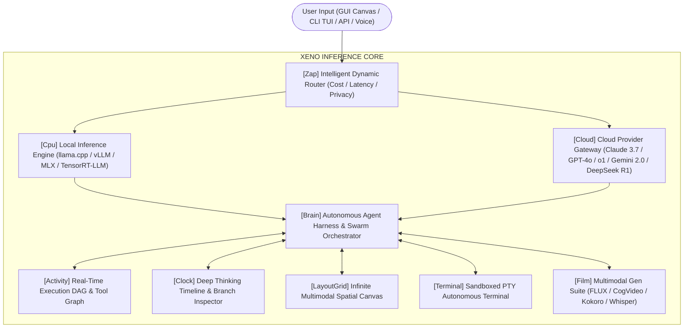

# [Sparkles] XENO INFERENCE — THE OMNI-MODAL AUTONOMOUS INFERENCE & SWARM AGENTIC PLATFORM
### *Next-Generation Local + Cloud AI Inference Engine, Spatial Canvas, Multi-Agent Swarm Harness & Sovereign Terminal Runtime*

```text
┌────────────────────────────────────────────────────────────────────────────────────────┐
│    _  ________   ______     _____   ____________________  ______   ____________        │
│   | |/ / ____/ | / / __ \   /  _/ | / / ____/ ____/ __ \/ ____/ | / / ____/ ____/      │
│   |   / __/ /  |/ / / / /   / //  |/ / /_  / __/ / /_/ / __/ /  |/ / /   / __/         │
│  /   / /___/ /|  / /_/ /  _/ // /|  / __/ / /___/ _, _/ /___/ /|  / /___/ /___         │
│ /_/|_\____/_/ |_/\____/  /___/_/ |_/_/   /_____/_/ |_/_____/_/ |_/\____/_____/         │
│                                                                                        │
│          [ HYBRID LOCAL/CLOUD COMPUTE ] ❖ [ MULTI-AGENT SWARM HARNESS ]               │
└────────────────────────────────────────────────────────────────────────────────────────┘
```

---

## [BookOpen] TABLE OF CONTENTS

1. [Executive Summary & Product Vision](#1-executive-summary--product-vision)
2. [Comparative Analysis & Competitive Edge](#2-comparative-analysis--competitive-edge)
3. [Unified Dual-Inference Engine (Local + Cloud Gateway)](#3-unified-dual-inference-engine-local--cloud-gateway)
4. [Agentic Loop & Autonomous Harness Architecture](#4-agentic-loop--autonomous-harness-architecture)
5. [High-End Interactive Spatial Canvas UI](#5-high-end-interactive-spatial-canvas-ui)
6. [Deep Thinking View & Granular Timeline Inspector](#6-deep-thinking-view--granular-timeline-inspector)
7. [Live Dynamic Tool & Execution DAG Graph](#7-live-dynamic-tool--execution-dag-graph)
8. [Comprehensive Tooling Arsenal & Model Context Protocol (MCP)](#8-comprehensive-tooling-arsenal--model-context-protocol-mcp)
9. [Multimodal Generative Creation Suite (Image, Video & Audio)](#9-multimodal-generative-creation-suite-image-video--audio)
10. [Autonomous Sandboxed Terminal & PTY Execution Bridge](#10-autonomous-sandboxed-terminal--pty-execution-bridge)
11. [Multi-Agent Swarm Mode & Recursive Verification Engine](#11-multi-agent-swarm-mode--recursive-verification-engine)
12. [XENO CLI / TUI: High-End Terminal Edition](#12-xeno-cli--tui-high-end-terminal-edition)
13. [System Architecture, Data Contracts & API Schemas](#13-system-architecture-data-contracts--api-schemas)
14. [Security, Privacy, and Sandboxing Specification](#14-security-privacy-and-sandboxing-specification)
15. [Hardware Optimization & Scalability Profiles](#15-hardware-optimization--scalability-profiles)
16. [Implementation Roadmap & Milestones](#16-implementation-roadmap--milestones)

---

## 1. EXECUTIVE SUMMARY & PRODUCT VISION

**XENO INFERENCE** is an ultra-futuristic, sovereign artificial intelligence inference workstation and multi-agent development environment designed to dismantle the barriers between local hardware acceleration and hyperscale cloud intelligence. 

Where contemporary AI tools isolate the user into rigid single-chat interfaces (ChatGPT, Claude web), basic local runners (Ollama, LM Studio), or text-only agentic terminal CLIs (Claude Code, Aider), **XENO INFERENCE** unifies the entire paradigm into a single, cohesive, high-performance ecosystem:



### Core Tenets of XENO INFERENCE
- **Zero-Latency Local + Cloud Sovereignty**: Run 1.5B to 70B+ quantized parameter models locally on consumer/workstation hardware (Apple Silicon, NVIDIA RTX, AMD ROCm, Intel Arc) while seamlessly offloading complex reasoning to cloud giants (Claude 3.7 Sonnet Thinking, OpenAI o1/o3-mini, Gemini 2.0 Flash/Pro, DeepSeek R1).
- **Spatial Infinite Canvas**: An infinite node-based reactive canvas with live editable code execution, interactive WebGL/HTML preview blocks, side-by-side AST diff views, and dynamic multimodal asset boards.
- **Microsecond Observability**: A live streaming DAG (Directed Acyclic Graph) showing active subagents, running tool calls, data flows, token velocities, and a collapsible Deep Thinking timeline that exposes the model's inner cognitive stream.
- **Self-Healing Recursive Multi-Agent Swarms**: A hierarchical multi-agent harness (Commander, Architect, Coder, Red-Team Auditor, QA Tester) executing recursive build-test-debug loops with automated test discovery, AST-level patching, and hallucination verification.
- **Dual-Surface Interface**: A gorgeous GPU-accelerated desktop application (Tauri + WebGL/Rust) paired with a companion high-end terminal edition (**XENO CLI / TUI**) rendered with cyberpunk ASCII art, Unicode telemetry graphs, and instant keyboard navigation.

---

## 2. COMPARATIVE ANALYSIS & COMPETITIVE EDGE

| Feature Dimension | XENO INFERENCE | Claude Code (CLI) | Cursor / Windsurf | LM Studio / Ollama | Devin / OpenDevin |
| :--- | :--- | :--- | :--- | :--- | :--- |
| **Inference Source** | **Hybrid Local + Cloud Unified** | Cloud API Only (Anthropic) | Cloud API Only | Local Models Only | Cloud API Only |
| **Spatial Canvas** | **Infinite Multimodal Visual Canvas** | None (CLI only) | Linear Sidecar Panels | Basic Chat List | Single Browser View |
| **Deep Thinking Inspector** | **Interactive Timeline + Branching** | Collapsed text output | None / Raw tokens | Raw text stream | Linear event stream |
| **Real-time Live DAG** | **Interactive WebGL Graph (Subagents/Tools)** | None | None | None | Basic status list |
| **Autonomous Terminal** | **Full PTY Sandboxed Bridge** | Native shell access | IDE Terminal wrapper | None | Sandboxed Docker PTY |
| **Multi-Agent Swarm** | **Hierarchical Recursive Swarm (5+ Roles)** | Single Agent loop | Single Assistant | None | Planner + Executor |
| **Recursive Debug Loop** | **AST Patching + Test Generation + Fix** | Manual retry on error | Inline edit suggestions | None | Test execution retry |
| **Image / Video Gen** | **Built-in Local (FLUX/SVD) + API Suite** | None | None | None | None |
| **Terminal CLI (TUI)** | **Rich Cyberpunk TUI + ASCII Telemetry** | High-utility CLI | CLI companion | Simple CLI | Web interface only |
| **MCP Protocol Support**| **Native 1st-Class Client + Server** | Limited MCP | Emerging | None | Custom integrations |

---

## 3. UNIFIED DUAL-INFERENCE ENGINE (LOCAL + CLOUD GATEWAY)

The core computational backbone of XENO INFERENCE is a hybrid runtime engine capable of multiplexing local hardware accelerators with commercial AI cloud APIs.

```
                                  ┌────────────────────────┐
                                  │   USER QUERY / TASK    │
                                  └───────────┬────────────┘
                                              │
                                  ┌───────────▼────────────┐
                                  │ SEMANTIC INTENT ROUTER │
                                  │ (Task & Privacy Class) │
                                  └─────┬────────────┬─────┘
                     Local Optimized    │            │ Cloud Capable
             ┌──────────────────────────┘            └──────────────────────────┐
             ▼                                                                  ▼
┌──────────────────────────────┐                              ┌───────────────────────────────────┐
│     LOCAL ENGINE RUNTIME     │                              │       CLOUD API GATEWAY           │
├──────────────────────────────┤                              ├───────────────────────────────────┤
│ • llama.cpp Backend (GGUF)   │                              │ • Anthropic Claude 3.7 / Sonnet   │
│ • vLLM Engine (PagedAttn)    │                              │ • OpenAI o1 / o3-mini / GPT-4o    │
│ • Apple MLX Hardware Accel   │                              │ • Google Gemini 2.0 Pro / Flash   │
│ • TensorRT-LLM / ExLlamaV2   │                              │ • DeepSeek R1 / V3 (Cloud & Self) │
│ • Speculative Draft Engines  │                              │ • Groq LPU (Ultra-Low Latency)    │
│ • VRAM Dynamic Allocator     │                              │ • OpenRouter / Together / Bedrock │
└──────────────┬───────────────┘                              └─────────────────┬─────────────────┘
               │                                                                │
               └───────────────────────┬────────────────────────────────────────┘
                                       ▼
                       ┌───────────────────────────────┐
                       │ UNIFIED STREAMING TOKEN BUS   │
                       │ (SSE / WebSocket / gRPC IPC)  │
                       └───────────────────────────────┘
```

### 3.1 Local Inference Subsystem
- **Modular Backends**:
  - `llama.cpp` wrapper for instant zero-dependency execution across CPU (AVX-512, NEON) and GPU (CUDA, Metal, Vulkan, ROCm, SYCL).
  - `vLLM` and `ExLlamaV2` backends for high-throughput continuous batching, PagedAttention, and FP8/INT4 tensor parallel execution.
  - Native `Apple MLX` framework support for M1/M2/M3/M4 Max/Ultra unified memory architectures, enabling zero-copy 128GB+ context inference.
- **Hardware-Aware Memory Manager**:
  - **Dynamic Layer Offloading**: Automatically slices model weights across VRAM and System RAM based on real-time telemetry from `NVML` / `MetalKit` / `ROCm-SMI`.
  - **KV Cache Quantization**: Configurable FP16, Q8_0, Q4_0 KV-cache formats to support 128k+ context windows on single consumer GPUs.
  - **Speculative Decoding Engine**: Pairs a lightweight local draft model (e.g., Qwen 2.5 0.5B or Llama 3.2 1B) with a heavy target model (e.g., Qwen 2.5 72B or DeepSeek R1) to accelerate generation speed by 2.5x–4x.
- **Model Formats Supported**: GGUF, EXL2, AWQ, GPTQ, Safetensors, ONNX Runtime.

### 3.2 Cloud API Gateway & Intelligent Router
- **Multi-Provider Unified SDK**:
  - Native integrations: Anthropic (Claude 3.7 Sonnet Thinking, 3.5 Haiku), OpenAI (o1, o3-mini, GPT-4o), Google (Gemini 2.0 Pro/Flash/Thinking), DeepSeek (R1, V3), Groq (LPU 500+ tok/s), Mistral, Together AI, AWS Bedrock, Cloudflare Workers AI.
- **Semantic Routing Policy**:
  - **Speed Priority**: Routes to Groq or local 8B models for simple queries, auto-completions, and syntax formatting (<50ms TTFT).
  - **Reasoning Priority**: Routes to Claude 3.7 Thinking, o1, or DeepSeek R1 for multi-step architecture design, security audits, and mathematical logic.
  - **Privacy Guard Mode**: Intercepts queries containing sensitive tokens, API keys, or proprietary file patterns and forces 100% air-gapped local model processing.
  - **Cost-Optimizer**: Automatically calculates token expenses per plan and predicts cost before executing heavy tool loops.

---

## 4. AGENTIC LOOP & AUTONOMOUS HARNESS ARCHITECTURE

The XENO Agent Harness implements a state-of-the-art **Plan-Act-Observe-Reflect-Verify** (PAORV) continuous loop capable of autonomous operations over hours of execution without cognitive drift.

```
       ┌────────────────────────────────────────────────────────┐
       │                   GOAL INITIALIZATION                  │
       └───────────────────────────┬────────────────────────────┘
                                   │
                                   ▼
       ┌────────────────────────────────────────────────────────┐
       │  1. REASONING & STRATEGY (Thinking Engine Phase)       │
       │  • Analyze context, constraints, and project topology   │
       │  • Decompose goal into hierarchical task graph (DAG)   │
       └───────────────────────────┬────────────────────────────┘
                                   │
                                   ▼
       ┌────────────────────────────────────────────────────────┐
       │  2. ACTION SELECTION & TOOL EMISSION                   │
       │  • Select exact tool: terminal, file_edit, browser...  │
       │  • Format JSON schema / MCP call with validation       │
       └───────────────────────────┬────────────────────────────┘
                                   │
                                   ▼
       ┌────────────────────────────────────────────────────────┐
       │  3. OBSERVATION & SENSORY INGESTION                    │
       │  • Capture stdout/stderr, file diffs, DOM states       │
       │  • Truncate & summarize large outputs into token budget│
       └───────────────────────────┬────────────────────────────┘
                                   │
                                   ▼
       ┌────────────────────────────────────────────────────────┐
       │  4. COGNITIVE REFLECTION & ANOMALY DETECTION           │
       │  • Did the action succeed? Did unexpected errors occur?│
       │  • Update internal state & hypothesis                  │
       └───────────────────────────┬────────────────────────────┘
                                   │
                                   ▼
┌──────────────────────────────────────────────────────────────────────┐
│  5. RECURSIVE VERIFICATION & INTEGRITY CHECK                         │
│  • AST validation, automated test execution, static analysis         │
│  • Pass criteria met?                                                │
└──────────────┬───────────────────────────────────────┬───────────────┘
               │ FAIL (Anomaly / Test Failure)         │ PASS (Verified)
               ▼                                       ▼
  ┌─────────────────────────┐            ┌───────────────────────────┐
  │  SELF-HEALING SUB-LOOP  │            │  TASK COMPLETION & COMMIT │
  │  • Synthesize patch     │            │  • Emit final artifact    │
  │  • Re-run specific step │            │  • Update global memory   │
  └────────────┬────────────┘            └───────────────────────────┘
               │
               └───────────► Returns to Step 1
```

### 4.1 Memory Hierarchy & Context Management
1. **Working Memory (L1 - In-Context)**: Dynamic sliding window with priority token pinning for system instructions, project index, and active file handles.
2. **Episodic Memory (L2 - Session History)**: High-speed local DuckDB / SQLite session store indexing all actions, tool outputs, and user feedback in the current workflow.
3. **Semantic Vector Memory (L3 - Long-Term Knowledge)**: Embedded vector index (Qdrant / Chroma / FastEmbed ONNX) storing codebases, documentation, historical bug fixes, and user preferences.
4. **Graph RAG (L4 - Project Topology)**: Codebase AST knowledge graph mapping function call trees, class hierarchies, dependency relationships, and API contracts.

---

## 5. HIGH-END INTERACTIVE SPATIAL CANVAS UI

The graphical user interface of XENO INFERENCE is designed around a spatial infinite canvas with glassmorphism, cyberpunk neon accents, and GPU-rendered dynamic surfaces.

```
+-------------------------------------------------------------------------------------------------------------+
│ [Sparkles] XENO INFERENCE v3.0  [WS: Omni-Engine]  [GPU: RTX 4090 - 24GB (62%)]  [Active: Claude 3.7 + R1]  │
+-------------------------------------------------------------------------------------------------------------+
│ [[LayoutGrid] Canvas] [[Clock] Timeline] [[Activity] Live DAG] [[Terminal] Terminal] [[Film] Studio] [[Settings] Config] │
+----------------------+---------------------------------------------------------------+----------------------+
│ [Folder] WORKSPACE   │ [LayoutGrid] SPATIAL CANVAS WORKSPACE                         │ [Zap] REAL-TIME HUD  │
│                      │                                                               │                      │
│ v [Box] src/         │  ┌────────────────────┐      ┌─────────────────────────────┐  │ [Brain] AGENT STATE: │
│   > [Folder] core/   │  │ [FileText] Task #1 │ ───► │ [Bot] Subagent: Backend     │  │   AUTONOMOUS LOOP    │
│   > [Folder] engine/ │  │ Refactor Auth Flow │      │ Model: DeepSeek R1 (Local)  │  │                      │
│   > [Folder] ui/     │  └────────────────────┘      └──────────────┬──────────────┘  │ [Rocket] TOKEN SPEED:│
│     [FileCode] index │                                             │                 │   124.8 tok/s        │
│     [FileCode] Canvas│                                             ▼                 │                      │
│                      │  ┌─────────────────────────────────────────────────────────┐  │ [HardDrive] VRAM:    │
│ v [FlaskConical] TEST│  │ [Terminal] Live Code Preview (AST Diff Sandbox)         │  │   14.8 / 24.0 GB     │
│   [Check] auth.ts    │  │ ```typescript                                           │  │                      │
│   [Clock] session.ts │  │ - export function verify(token: string) { ... }         │  │ [Coins] EST. COST:   │
│                      │  │ + export async function verifySessionToken(t: Token) {..│  │   $0.0214 / session  │
│ v [Wrench] MCP TOOLS │  │ ```                                                     │  │                      │
│   [Check] terminal   │  │ [ [Play] Run Sandbox ] [ [RotateCcw] Rollback ] [ [Save] Commit ] │ [Globe] ACTIVE TOOLS:│
│   [Check] lsp_server │  └─────────────────────────────────────────────────────────┘  │   • terminal_exec    │
│   [Check] browser    │                                                               │   • lsp_diagnostics  │
+----------------------+---------------------------------------------------------------+----------------------+
│ [MessageSquare] OMNI-BAR: [Ask a question, issue a terminal command, or press TAB...] [[Zap] Run (Ctrl+Enter)]│
+-------------------------------------------------------------------------------------------------------------+
```

### 5.1 Interactive Canvas Capabilities
- **Infinite Zoomable Surface**: Infinite pan, zoom, and spatial clustering using WebGL/Canvas2D with smooth 120 FPS physics.
- **Polymorphic Node Types**:
  - **Chat & Prompt Nodes**: Rich markdown, LaTeX math equations, collapsible thought blocks, and instant voice-to-text input.
  - **Live Code Execution Blocks**: Live embedded Monaco/CodeMirror code blocks with integrated syntax linters, LSP auto-complete, and instant local runtime sandbox (Node.js, Python, Rust WebAssembly).
  - **Artifact Projection Viewport**: Interactive rendering of HTML/CSS/JS applications, React components, 3D WebGL scenes, and SVG diagrams in isolated iframes.
  - **Visual Diff Nodes**: Side-by-side AST-aware diff editors displaying proposed modifications with single-click cherry-picking, line-by-line staging, and rollback history.
  - **Media Asset Nodes**: Drag-and-drop generative image boards, audio waveforms with instant scrub-and-play, and video timeline previews.

---

## 6. DEEP THINKING VIEW & GRANULAR TIMELINE INSPECTOR

XENO INFERENCE offers cognitive transparency that surpasses basic chat interfaces by visualizing the AI model’s internal reasoning stream in real-time.

```
┌─────────────────────────────────────────────────────────────────────────────────────────────────────────────┐
│ [Clock] DEEP THINKING & REASONING TIMELINE INSPECTOR                                                        │
├─────────────────────────────────────────────────────────────────────────────────────────────────────────────┤
│ Step 1: Goal Analysis ──► Step 2: AST Analysis ──► Step 3: Tool Execution ──► Step 4: Recursive Verification │
├─────────────────────────────────────────────────────────────────────────────────────────────────────────────┤
│ v [Brain] Cognitive Stream [Elapsed: 1.42s | Generated: 840 reasoning tokens | Speed: 112 tok/s]            │
│   ├── [0.10s] [Search] Identified objective: Optimize memory footprint of WebSockets event loop.           │
│   ├── [0.35s] [Lightbulb] Hypothesis: Ring buffer allocation in `src/net/buffer.rs` is causing GC pressure.│
│   ├── [0.60s] [Wrench] Selecting tool: `lsp_find_references` for symbol `RingBuffer` (confidence: 98.4%).   │
│   ├── [0.95s] [BarChart2] Tool Response Received: 14 usages found across 3 files.                           │
│   ├── [1.20s] [AlertTriangle] Edge Case Detected: Zero-copy deserialization might violate thread-safety.   │
│   └── [1.42s] [CheckCircle2] Synthesizing fix: Replace with `crossbeam::queue::ArrayQueue` with locks.      │
├─────────────────────────────────────────────────────────────────────────────────────────────────────────────┤
│ [GitBranch] SPECULATIVE REASONING TREE (Branch Inspector)                                                   │
│   ├── Branch A (Optimistic Lock)  ───► [Evaluated: Potential Deadlock under 10k req/s] ──► [XCircle] Pruned │
│   └── Branch B (Lock-Free Queue)  ───► [Evaluated: Zero Contention, 0.4ms latency]     ──► [Star] Selected  │
└─────────────────────────────────────────────────────────────────────────────────────────────────────────────┘
```

### Key Features of Deep Thinking View
1. **Interactive Collapsible Cognitive Trees**: Inspect reasoning tokens hierarchicalized by goal, hypothesis, tool selection, edge-case checking, and final conclusion.
2. **Speculative Branch Inspector**: Shows alternate hypotheses evaluated by the model, why specific approaches were pruned, and which path was selected.
3. **Live Latency & Velocity Telemetry**: Real-time HUD showing Time-to-First-Token (TTFT), tokens/sec for reasoning vs. output tokens, KV-cache reuse ratio, and exact model invocation cost.
4. **Time-Travel Debugger**: Rewind the reasoning stream to any prior cognitive step, tweak the agent's premise, and re-branch the entire generation without losing prior context.

---

## 7. LIVE DYNAMIC TOOL & EXECUTION DAG GRAPH

XENO INFERENCE features a real-time visual Directed Acyclic Graph (DAG) that renders all active subagents, scheduled tools, asynchronous background processes, and data dependencies.

```mermaid
graph LR
    UserPrompt["[User] User: Implement Payment Webhook"] --> Orchestrator["[Crown] Commander Agent"]
    
    Orchestrator --> Subagent1["[Box] Architect Agent<br/>(Spec & Schema Design)"]
    Orchestrator --> Subagent2["[Code] Coder Agent<br/>(Stripe Webhook Handler)"]
    
    Subagent1 --> Tool_FS["[Folder] filesystem_read<br/>(schema.prisma)"]
    Subagent2 --> Tool_LSP["[Search] lsp_definition<br/>(PaymentService)"]
    Subagent2 --> Tool_Write["[Edit3] file_write<br/>(webhook.ts)"]
    
    Tool_Write --> Subagent3["[FlaskConical] QA Tester Agent<br/>(Automated Unit Tests)"]
    Subagent3 --> Tool_Term["[Terminal] terminal_exec<br/>(npm test webhook)"]
    
    Tool_Term --> ResultNode{"Test Outcome"}
    ResultNode -- "[XCircle] Fail (401 Bad Sig)" --> Subagent4["[Stethoscope] Self-Healing Debugger"]
    Subagent4 --> Tool_Fix["[Bandage] multi_replace_file<br/>(webhook.ts)"]
    Tool_Fix --> Subagent3
    ResultNode -- "[CheckCircle2] Pass (200 OK)" --> FinalArtifact["[PartyPopper] Verified Output & PR"]

    style UserPrompt fill:#1e1e2e,stroke:#89b4fa,stroke-width:2px;
    style Orchestrator fill:#313244,stroke:#f38ba8,stroke-width:2px;
    style Subagent1 fill:#181825,stroke:#a6e3a1,stroke-width:2px;
    style Subagent2 fill:#181825,stroke:#a6e3a1,stroke-width:2px;
    style Subagent3 fill:#181825,stroke:#fab387,stroke-width:2px;
    style Subagent4 fill:#45475a,stroke:#eba0ac,stroke-width:2px;
    style FinalArtifact fill:#11111b,stroke:#a6e3a1,stroke-width:3px;
```



### Real-Time Telemetry & Visual Indicators
- **Node Glow Statuses**:
  - `[Circle]` **Cyan Pulse**: Tool currently running in background sandbox.
  - `[CheckCircle2]` **Solid Emerald**: Tool execution passed with 0 exit code.
  - `[AlertOctagon]` **Crimson Glow**: Tool execution failed / runtime exception encountered.
  - `[AlertTriangle]` **Amber Shimmer**: Self-healing loop active; resolving AST anomaly.
- **Live Streamed Edge Particles**: Animated data packets flowing across graph edges visualizing JSON payloads and data transfers between subagents.
- **Interactive Node Controls**: Click any node to open raw stdout/stderr, modify arguments on the fly, or pause/abort running subprocesses.

---

## 8. COMPREHENSIVE TOOLING ARSENAL & MODEL CONTEXT PROTOCOL (MCP)

XENO INFERENCE includes a native Model Context Protocol (MCP) host and client runtime, allowing instant interoperability with hundreds of local and cloud tools.

```
┌─────────────────────────────────────────────────────────────────────────────┐
│                      XENO INFERENCE TOOL HARNESS ENGINE                     │
├─────────────────────────────────────────────────────────────────────────────┤
│ ┌────────────────────────────────┐       ┌────────────────────────────────┐ │
│ │ [Terminal] SYSTEM & RUNTIME    │       │ [Code] CODE INTELLIGENCE (LSP) │ │
│ ├────────────────────────────────┤       ├────────────────────────────────┤ │
│ │ • `terminal_exec` (Sandboxed)  │       │ • `lsp_goto_definition`        │ │
│ │ • `terminal_interactive_send`  │       │ • `lsp_find_references`        │ │
│ │ • `process_monitor_kill`       │       │ • `lsp_diagnostics_lint`       │ │
│ │ • `env_variable_vault`         │       │ • `ast_grep_structural_search` │ │
│ └────────────────────────────────┘       └────────────────────────────────┘ │
│ ┌────────────────────────────────┐       ┌────────────────────────────────┐ │
│ │ [Folder] ATOMIC FILE SYSTEM    │       │ [Globe] WEB & SENSORY TOOLS    │ │
│ ├────────────────────────────────┤       ├────────────────────────────────┤ │
│ │ • `file_read_slice`            │       │ • `browser_navigate_screenshot`│ │
│ │ • `multi_replace_file_content` │       │ • `browser_dom_click_type`     │ │
│ │ • `atomic_write_file`          │       │ • `web_search_duckduckgo_brave`│ │
│ │ • `fuzzy_glob_ripgrep`         │       │ • `read_url_markdown_extractor`│ │
│ └────────────────────────────────┘       └────────────────────────────────┘ │
│ ┌────────────────────────────────┐       ┌────────────────────────────────┐ │
│ │ [Puzzle] MODEL CONTEXT (MCP)   │       │ [ShieldCheck] VERIFICATION     │ │
│ ├────────────────────────────────┤       ├────────────────────────────────┤ │
│ │ • Native MCP Client & Server   │       │ • `test_runner_jest_pytest`    │ │
│ │ • Dynamic Server Discovery     │       │ • `hallucination_consensus_chk`│ │
│ │ • STDIO & SSE Transport Layer  │       │ • `security_semgrep_scanner`   │ │
│ └────────────────────────────────┘       └────────────────────────────────┘ │
└─────────────────────────────────────────────────────────────────────────────┘
```

### Built-in Tool Specifications
1. **`terminal_exec`**: Runs shell commands inside a dedicated virtual PTY session with configurable timeout, automatic SIGINT capture, streaming stdout/stderr parsing, and working directory isolation.
2. **`multi_replace_file_content`**: High-precision atomic file editor that applies multiple non-contiguous line replacements using exact character matches with AST validation to prevent syntax breakages.
3. **`lsp_bridge`**: Embedded Language Server Protocol client connecting to `rust-analyzer`, `pyright`, `typescript-language-server`, `gopls`, and `clangd` to give the AI real-time compiler diagnostics and type checks before executing code.
4. **`browser_agent`**: Headless Playwright browser agent capable of navigating web applications, capturing full-page screenshots, parsing accessibility DOM trees, executing user clicks, and testing web frontends end-to-end.
5. **`git_autopilot`**: Automates Git branch management, worktree isolation for isolated subagent work, semantic commit message synthesis, and automated merge conflict resolution.

---

## 9. MULTIMODAL GENERATIVE CREATION SUITE (IMAGE, VIDEO & AUDIO)

XENO INFERENCE embeds a complete multimodal creation studio supporting both local open-weights generation and cloud creative APIs.

```
                                  ┌───────────────────────────┐
                                  │ [Film] MULTIMODAL STUDIO  │
                                  └─────────────┬─────────────┘
                ┌───────────────────────────────┼───────────────────────────────┐
                ▼                               ▼                               ▼
┌──────────────────────────────┐ ┌──────────────────────────────┐ ┌──────────────────────────────┐
│    [Image] IMAGE GENERATION  │ │    [Video] VIDEO GENERATION  │ │     [Mic] AUDIO & VOICE      │
├──────────────────────────────┤ ├──────────────────────────────┤ ├──────────────────────────────┤
│ Local:                       │ │ Local:                       │ │ Local:                       │
│ • FLUX.1 (Schnell / Dev)     │ │ • CogVideoX-5B / 2B          │ │ • Kokoro-82M (Ultra-Fast TTS)│
│ • SDXL Turbo / Lightning     │ │ • Stable Video Diff (SVD)    │ │ • Whisper Large v3 Turbo     │
│ • ComfyUI Headless Node API  │ │ • AnimateDiff Local          │ │ • Piper Neural TTS Engine    │
│ Cloud:                       │ │ Cloud:                       │ │ Cloud:                       │
│ • Midjourney API v6          │ │ • Runway Gen-3 Alpha         │ │ • ElevenLabs Multilingual v2 │
│ • DALL-E 3 (OpenAI)          │ │ • Luma Dream Machine         │ │ • Cartesia Sonic (Voice-API) │
│ • Google Imagen 3            │ │ • Kling AI / Pika 2.0        │ │ • OpenAI Whisper Cloud       │
└──────────────────────────────┘ └──────────────────────────────┘ └──────────────────────────────┘
```

### Multimodal Pipeline Architecture
- **ComfyUI Headless Bridge**: Connects directly to local ComfyUI graph workflows over WebSockets, enabling custom LoRA loading, ControlNet poses, and upscale models.
- **In-Canvas Visual Editor**: Generated images and video frames are projected directly onto the Infinite Canvas where subagents can annotate, crop, or pass them back into vision-capable LLMs (GPT-4o, Claude 3.7, Gemini 2.0 Flash) for visual QA testing.
- **Real-Time Voice AI Mode**: Full-duplex conversational voice mode powered by local Whisper STT (<100ms) + Local LLM + Kokoro TTS (<150ms), allowing users to pair-program hands-free via spoken audio.

---

## 10. AUTONOMOUS SANDBOXED TERMINAL & PTY EXECUTION BRIDGE

XENO INFERENCE incorporates a sandboxed Pseudo-Terminal (PTY) subsystem that rivals and exceeds traditional terminal wrappers by providing real-time AI autonomous interaction.

```
┌─────────────────────────────────────────────────────────────────────────────────────────────────────────────┐
│ [Terminal] XENO AUTONOMOUS PTY TERMINAL [Session: #pty-8491] [Sandbox: Linux / macOS / Windows PTY]         │
├─────────────────────────────────────────────────────────────────────────────────────────────────────────────┤
│ $ cargo test --package xeno-core                                                                            │
│    Compiling xeno-core v0.1.0 (/workspaces/xeno/crates/xeno-core)                                            │
│    Finished `test` profile [unoptimized + debuginfo] target(s) in 2.14s                                     │
│     Running unittests src/lib.rs (target/debug/deps/xeno_core-4a1b2c3d)                                     │
│                                                                                                             │
│ running 14 tests                                                                                            │
│ test engine::tests::test_kv_cache_eviction ... ok                                                           │
│ test engine::tests::test_speculative_draft ... ok                                                           │
│ test net::tests::test_websocket_handshake ... FAILED                                                        │
│                                                                                                             │
│ failures:                                                                                                   │
│ ---- net::tests::test_websocket_handshake stdout ----                                                       │
│ thread 'net::tests::test_websocket_handshake' panicked at crates/xeno-core/src/net.rs:88:9:                 │
│ assertion `left == right` failed: Handshake timeout exceeded                                                │
│   left: 504                                                                                                 │
│  right: 101                                                                                                 │
│                                                                                                             │
│ ----------------------------------------------------------------------------------------------------------- │
│ [Bot] XENO AI INTERVENTION DETECTED:                                                                        │
│ > Reading failure at crates/xeno-core/src/net.rs:88:9                                                       │
│ > Root Cause: Mock server did not flush headers before handshake validation.                               │
│ > Executing Action: `multi_replace_file_content` on `crates/xeno-core/src/net.rs` to add immediate flush.   │
│ > Auto Re-running command: `cargo test --package xeno-core --lib net::tests::test_websocket_handshake`     │
│                                                                                                             │
│ test net::tests::test_websocket_handshake ... ok                                                            │
│ [CheckCircle2] Status: Bug Fixed & Verified (Test passed in 0.42s).                                         │
└─────────────────────────────────────────────────────────────────────────────────────────────────────────────┘
```

### Terminal Security Tiers
- **Tier 1 (Read-Only / Safe)**: `ls`, `cat`, `git status`, `cargo check`, `npm test` — Auto-executed with zero prompt interruption.
- **Tier 2 (Guarded Operations)**: `git commit`, `npm install <pkg>`, `file writes` — Executed with instant visual diff preview and automated rollback snapshot.
- **Tier 3 (Destructive / Elevated)**: `rm -rf`, `sudo`, `git push --force`, `database drop` — Requires explicit user approval or two-agent cryptographic signing in Swarm Mode.

---

## 11. MULTI-AGENT SWARM MODE & RECURSIVE VERIFICATION ENGINE

When complex goals exceed the capability of a single agent, XENO INFERENCE activates **Swarm Mode**, spinning up a specialized council of autonomous agents working in parallel.

```
                           ┌─────────────────────────────────────┐
                           │   [Crown] COMMANDER / ORCHESTRATOR  │
                           │   (Task Planning & Token Budget)    │
                           └──────────────────┬──────────────────┘
                                              │
              ┌───────────────────────────────┼───────────────────────────────┐
              ▼                               ▼                               ▼
┌───────────────────────────┐   ┌───────────────────────────┐   ┌───────────────────────────┐
│     [Box] ARCHITECT       │   │       [Code] CODER        │   │    [Shield] RED TEAM      │
├───────────────────────────┤   ├───────────────────────────┤   ├───────────────────────────┤
│ • System Design & Schemas │   │ • High-Speed Code Writing │   │ • Vuln Scanner & Fuzzing  │
│ • API Contracts & Types   │   │ • Component Synthesis     │   │ • Prompt Injection Defense│
│ • Dependency Graphing     │   │ • Atomic File Modifying   │   │ • Secret Leak Detection   │
└─────────────┬─────────────┘   └─────────────┬─────────────┘   └─────────────┬─────────────┘
              │                               │                               │
              └───────────────────────────────┼───────────────────────────────┘
                                              ▼
                                ┌───────────────────────────┐
                                │   [FlaskConical] QA AGENT │
                                ├───────────────────────────┤
                                │ • Test Harness Generator  │
                                │ • Dynamic AST Evaluator   │
                                │ • Regression Validator    │
                                └─────────────┬─────────────┘
                                              │
                                              ▼
                               ┌─────────────────────────────┐
                               │ [RotateCw] RECURSIVE DEBUG  │
                               │   (Iterate until 100% Pass) │
                               └─────────────────────────────┘
```

### Recursive Self-Debug & Authenticity Verification Engine
1. **Dynamic Test Harness Synthesis**: The QA Auditor automatically creates unit and integration test fixtures targeting newly implemented code before the code is even committed.
2. **Hallucination Detection via Cross-Consensus**: For critical logic or mathematical proofs, three independent models (e.g. DeepSeek R1, Claude 3.7, and Local Qwen 72B) evaluate the output independently. If consensus is <100%, the discrepancies are flagged for formal verification.
3. **AST Invariant Checking**: Validates that imports, type signatures, and schema boundaries are mathematically sound without circular dependencies or unhandled Promise rejections.

---

## 12. XENO CLI / TUI: HIGH-END TERMINAL EDITION

For developers who thrive inside raw terminal environments, XENO INFERENCE includes a standalone, lightning-fast Terminal User Interface (TUI) built in Rust using `Ratatui` and `Crossterm`.

```
=================================================================================================================================
  ██╗  ██╗ ███████╗ ███╗   ██╗  ██████╗     ██╗ ███╗   ██╗ ███████╗ ███████╗ ██████╗  ███████╗ ███╗   ██╗  ██████╗  ███████╗
  ╚██╗██╔╝ ██╔════╝ ████╗  ██║ ██╔═══██╗    ██║ ████╗  ██║ ██╔════╝ ██╔════╝ ██╔══██╗ ██╔════╝ ████╗  ██║ ██╔════╝  ██╔════╝
   ╚███╔╝  █████╗   ██╔██╗ ██║ ██║   ██║    ██║ ██╔██╗ ██║ █████╗   █████╗   ██████╔╝ █████╗   ██╔██╗ ██║ ██║       █████╗  
   ██╔██╗  ██╔══╝   ██║╚██╗██║ ██║   ██║    ██║ ██║╚██╗██║ ██╔══╝   ██╔══╝   ██╔══██╗ ██╔══╝   ██║╚██╗██║ ██║       ██╔══╝  
  ██╔╝ ██╗ ███████╗ ██║ ╚████║ ╚██████╔╝    ██║ ██║ ╚████║ ██║      ███████╗ ██║  ██║ ███████╗ ██║ ╚████║ ╚██████╗  ███████╗
  ╚═╝  ╚═╝ ╚══════╝ ╚═╝  ╚═══╝  ╚═════╝     ╚═╝ ╚═╝  ╚═══╝ ╚═╝      ╚══════╝ ╚═╝  ╚═╝ ╚══════╝ ╚═╝  ╚═══╝  ╚═════╝  ╚══════╝
  [MODE: SWARM AUTONOMOUS] │ [LOCAL: Llama-3.3-70B-Q4_K_M (CUDA)] │ [CLOUD: Claude-3.7-Sonnet] │ [TOK: 142.6 t/s]
=================================================================================================================================
┌─ [1] AGENT COGNITIVE STREAM ────────────────────────┐┌─ [2] LIVE DAG & TOOL MONITOR ────────────────────────┐
│ > [15:42:01] [Brain] Planner: Decomposing request... ││ ┌──────────────────────────────────────────────────┐ │
│ > [15:42:02] [Box] Spawning 2 worker subagents...   ││ │ [Orchestrator] ──► [Coder] ──► [terminal_exec]   │ │
│ > [15:42:03] [Wrench] Executing: `git diff HEAD~1`  ││ │       │                                          │ │
│ > [15:42:04] [Search] Found 3 files in src/core/    ││ │       └──────────► [QA-Test] ──► [cargo test]   │ │
│ > [15:42:05] [Lightbulb] Synthesizing memory patch  ││ └──────────────────────────────────────────────────┘ │
│ > [15:42:06] [FlaskConical] QA Agent running tests..││ SYSTEM TELEMETRY:                                     │
│   ├── tests/engine_test.rs ... PASS                 ││ VRAM: [████████████████░░░░░░] 16.2 / 24.0 GB (67%)    │
│   └── tests/memory_test.rs ... PASS                 ││ GPU:  [████████████████████░░] 88% Core Load          │
│ > [15:42:07] [PartyPopper] Goal achieved (0 errors).││ SPEED: [142.6 tokens/sec]  LATENCY: [28ms TTFT]       │
└─────────────────────────────────────────────────────┘└───────────────────────────────────────────────────────┘
┌─ [3] ACTIVE FILE DIFF & COMMAND RUNNER ─────────────────────────────────────────────────────────────────────┐
│ [FileCode] src/engine/memory.rs                                                                             │
│ 112 │ - pub fn allocate_tensor(&mut self, size: usize) -> *mut u8 {                                         │
│ 113 │ + pub fn allocate_tensor_pinned(&mut self, size: usize) -> Result<PinnedBuffer, MemoryError> {        │
│ 114 │ +     self.arena.alloc_aligned(size, 64)                                                              │
└─────────────────────────────────────────────────────────────────────────────────────────────────────────────┘
 XENO-CLI > Type a prompt, /swarm, /canvas, /tools, or /exit │ [Ctrl+C: Interrupt] [Tab: Auto-complete]
=================================================================================================================
```

### Key Highlights of XENO CLI
- **Instant Boot (<15ms)**: Native compiled binary with zero Node.js/Python startup overhead.
- **Braille/Unicode Real-Time Graphs**: Live rendering of VRAM usage, token velocity, and tool DAG using terminal Braille characters and ANSI RGB truecolor.
- **Vim-Inspired Keybindings**: Rapid switching between thinking view, diff inspector, and active terminal pane using `hjkl` or customized hotkeys.
- **Session Parity with GUI**: Seamlessly switch between the desktop GUI Canvas and the terminal CLI with real-time state synchronization via local IPC socket.

---

## 13. SYSTEM ARCHITECTURE, DATA CONTRACTS & API SCHEMAS

XENO INFERENCE is engineered as a high-performance modular system separating the low-level compute engine from the user interfaces via high-speed IPC (gRPC / WebSocket / Shared Memory).

```
┌───────────────────────────────────────────────────────────────────────────────┐
│                               USER INTERFACES                                 │
│  ┌─────────────────────────────────────────┐  ┌────────────────────────────┐  │
│  │ [Laptop] Desktop App (Tauri v2 + React) │  │ [Terminal] XENO CLI (Rust  │  │
│  │    Three.js WebGL Spatial Canvas        │  │    Ratatui + Crossterm TUI)│  │
│  └────────────────────┬────────────────────┘  └─────────────┬──────────────┘  │
└───────────────────────┼─────────────────────────────────────┼─────────────────┘
                        │ Local WebSocket / IPC Socket        │
┌───────────────────────▼─────────────────────────────────────▼─────────────────┐
│                     XENO CORE APPLICATION DAEMON (Rust / Go)                  │
├───────────────────────────────────────────────────────────────────────────────┤
│ • Event-Driven Async Message Bus (Tokio)                                      │
│ • State Machine & Multi-Agent Swarm Orchestrator                              │
│ • Model Context Protocol (MCP) Router & Dynamic Host Engine                   │
│ • Sandboxed Virtual PTY Terminal Subsystem                                    │
│ • Embedded SQLite / DuckDB Storage & FastEmbed Vector Store                   │
└───────────────────────┬─────────────────────────────────────┬─────────────────┘
                        │                                     │
        ┌───────────────▼──────────────┐       ┌──────────────▼───────────────┐
        │  LOCAL INFERENCE BRIDGE      │       │     CLOUD PROVIDER CLIENTS   │
        ├──────────────────────────────┤       ├──────────────────────────────┤
        │ • `libllama` C++ FFI Bindings│       │ • Anthropic Messages API v1  │
        │ • vLLM OpenAI-Compatible API │       │ • OpenAI Responses API       │
        │ • Apple MLX Python IPC Bridge│       │ • Google Gemini REST / GRPC  │
        │ • TensorRT-LLM Execution FFI │       │ • DeepSeek & Groq Engines    │
        └──────────────────────────────┘       └──────────────────────────────┘
```

### Core Data Contracts (JSON-Schema / TypeScript)

#### Agent Execution Event Schema
```typescript
interface XenoAgentStepEvent {
  eventId: string;
  timestamp: number; // Unix epoch ms
  sessionId: string;
  agentRole: "commander" | "architect" | "coder" | "tester" | "security";
  executionPhase: "thinking" | "tool_call" | "observation" | "reflection" | "verified";
  
  // Cognitive Reasoning Payload
  thinking?: {
    rawTokens: string;
    elapsedMs: number;
    tokensPerSecond: number;
    branchId: string;
    isPruned: boolean;
  };

  // Tool Call Specification
  toolCall?: {
    callId: string;
    toolName: string;
    arguments: Record<string, unknown>;
    mcpServer?: string;
  };

  // Tool Observation Output
  observation?: {
    exitCode: number;
    stdout: string;
    stderr: string;
    diffSnippet?: string;
    astValidationPassed: boolean;
  };

  // Telemetry & Hardware Stats
  telemetry: {
    modelUsed: string;
    backendType: "local_gguf" | "local_mlx" | "local_vllm" | "cloud_api";
    vramAllocatedBytes: number;
    promptTokens: number;
    completionTokens: number;
    estimatedCostUsd: number;
  };
}
```

#### Multi-Agent DAG Node Contract
```typescript
interface XenoDAGNode {
  nodeId: string;
  label: string;
  nodeType: "orchestrator" | "subagent" | "tool_exec" | "verification_gate" | "artifact";
  status: "pending" | "running" | "success" | "failed" | "self_healing";
  dependencies: string[]; // Node IDs that must resolve before execution
  assignedModel: {
    provider: "local" | "anthropic" | "openai" | "google" | "deepseek" | "groq";
    modelName: string;
    temperature: number;
  };
  outputPayload?: unknown;
}
```

---

## 14. SECURITY, PRIVACY, AND SANDBOXING SPECIFICATION

XENO INFERENCE is designed with enterprise-grade privacy and zero-trust local sandboxing.

### 14.1 Air-Gapped Zero-Leakage Guarantee
- **Local Isolation Mode**: Enforces that zero network packets leave the machine. All HTTP/DNS outgoing requests from cloud adapters are hard-blocked at the socket layer.
- **PII & Secret Sanitizer**: Before any prompt is dispatched to cloud endpoints, a local high-speed regex & NER (Named Entity Recognition) scrubber strips out AWS keys, SSH keys, internal IP addresses, and user-specified confidential tokens.

### 14.2 Terminal Execution Sandboxing
- **Linux**: Execution isolated via `unshare` namespaces, `cgroups v2` memory/CPU bounds, and `seccomp-bpf` syscall filters preventing root escalation.
- **macOS**: Sandboxed using `sandbox-exec` profiles restricting disk write permissions strictly to the active workspace directory.
- **Windows**: Isolated using Windows Job Objects and AppContainer sandboxes with controlled file system access.

---

## 15. HARDWARE OPTIMIZATION & SCALABILITY PROFILES

XENO INFERENCE dynamically tunes its compute graph according to detected host hardware:

| Hardware Tier | Target Hardware | Local Model Configuration | Cloud Fallback Role | Max Concurrency |
| :--- | :--- | :--- | :--- | :--- |
| **Tier 1: Ultra Mobile** | Apple M1/M2/M3 (16GB RAM) or RTX 4060 (8GB VRAM) | Llama 3.2 3B / Qwen 2.5 7B (Q4_K_M) + Whisper Turbo | Heavy reasoning & code synthesis (Claude 3.7 / o3-mini) | 2 Parallel Agents |
| **Tier 2: Workstation** | Apple M3/M4 Max (64GB-128GB) or RTX 4090 (24GB VRAM) | Qwen 2.5 32B / Llama 3.3 70B (Q4_K_M / EXL2) + FLUX.1 Schnell | Complex architectural planning & verification | 6 Parallel Agents |
| **Tier 3: Extreme Multi-GPU** | Dual RTX 4090 / Quad A6000 / Apple M2 Ultra (192GB) | DeepSeek R1 671B (MoE INT4) / Qwen 2.5 72B FP8 + SVD Video | 100% Autonomous Sovereign Mode (0% Cloud dependency) | 16+ Parallel Agents in Swarm |

---

## 16. IMPLEMENTATION ROADMAP & MILESTONES

```
┌────────────────────────────────────────────────────────────────────────────────────────────────┐
│ PHASE 1: CORE INFERENCE & BACKEND FOUNDATION                                     [WEEKS 01-04] │
│ • Implement unified inference router (llama.cpp FFI + Cloud API Gateway)                       │
│ • Build asynchronous token bus and telemetry streaming pipeline                               │
│ • Build sandboxed virtual PTY terminal manager with command safety guards                     │
├────────────────────────────────────────────────────────────────────────────────────────────────┤
│ PHASE 2: AGENT HARNESS & AUTONOMOUS LOOP                                        [WEEKS 05-08] │
│ • Implement PAORV (Plan-Act-Observe-Reflect-Verify) state machine                              │
│ • Build Model Context Protocol (MCP) host with standard tool library                          │
│ • Develop AST-aware file patching and LSP diagnostic bridge                                   │
├────────────────────────────────────────────────────────────────────────────────────────────────┤
│ PHASE 3: SPATIAL CANVAS & GUI WORKSPACE                                          [WEEKS 09-12] │
│ • Develop Tauri v2 + React 19 infinite canvas workspace                                        │
│ • Build live WebGL DAG visualizer with animated execution flows                                │
│ • Implement Deep Thinking Timeline and speculative branch inspector                           │
├────────────────────────────────────────────────────────────────────────────────────────────────┤
│ PHASE 4: MULTI-AGENT SWARM & RECURSIVE DEBUGGER                                  [WEEKS 13-16] │
│ • Implement multi-role Swarm orchestrator (Commander, Architect, Coder, QA, Red-Team)         │
│ • Build automated test generation and recursive self-healing loop                              │
│ • Integrate cross-model consensus hallucination detection                                      │
├────────────────────────────────────────────────────────────────────────────────────────────────┤
│ PHASE 5: MULTIMODAL SUITE & XENO CLI (TUI)                                       [WEEKS 17-20] │
│ • Build native Rust Ratatui terminal edition (XENO CLI) with ASCII telemetry                   │
│ • Embed local/cloud Image (FLUX) and Video (CogVideoX) generative pipelines                    │
│ • Integrate full-duplex real-time voice mode (Whisper + Kokoro)                                │
├────────────────────────────────────────────────────────────────────────────────────────────────┤
│ PHASE 6: ENTERPRISE SECURITY, BENCHMARKING & LAUNCH                              [WEEKS 21-24] │
│ • Formal zero-trust security audit and local sandbox hardening                                 │
│ • Benchmarking against Claude Code, Cursor, and Devin on SWE-bench Verified                    │
│ • Public Alpha & Production Binaries for Windows, macOS, and Linux                             │
└────────────────────────────────────────────────────────────────────────────────────────────────┘
```

---

## [Flag] CONCLUSION & ARCHITECTURAL SUMMARY

**XENO INFERENCE** represents the pinnacle of modern AI engineering: a sovereign, zero-compromise platform that merges the unconstrained reasoning power of top-tier cloud models with the raw speed, privacy, and cost-efficiency of local hardware acceleration.

By unifying an **Infinite Spatial Canvas**, a **Deep Thinking Inspector**, a **Live DAG Execution Visualizer**, an **Autonomous Sandboxed PTY Terminal**, and a **Recursive Multi-Agent Swarm**, XENO INFERENCE establishes a new benchmark for autonomous AI pair-programming and cognitive workflows.

***

*Document Version: 3.0.0-PROD-SPEC*  
*Architecture Blueprint: XENO INFERENCE*  
*Target Platforms: Windows 11 / macOS Sonoma & Sequoia / Linux x86_64 & aarch64*  
*Generated for: Workspace Sovereign AI Deployment*

